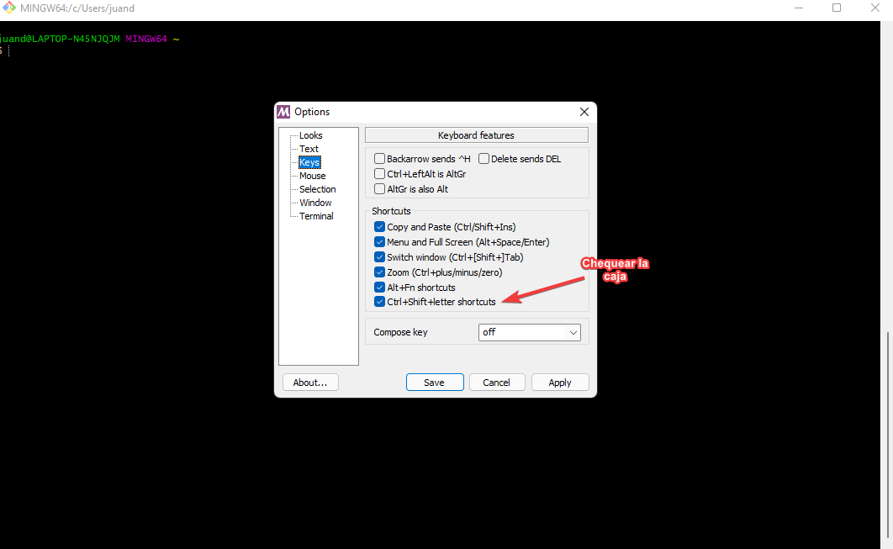
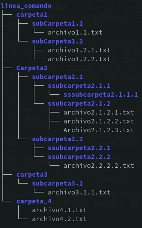
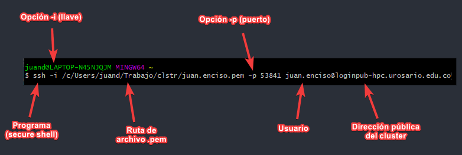
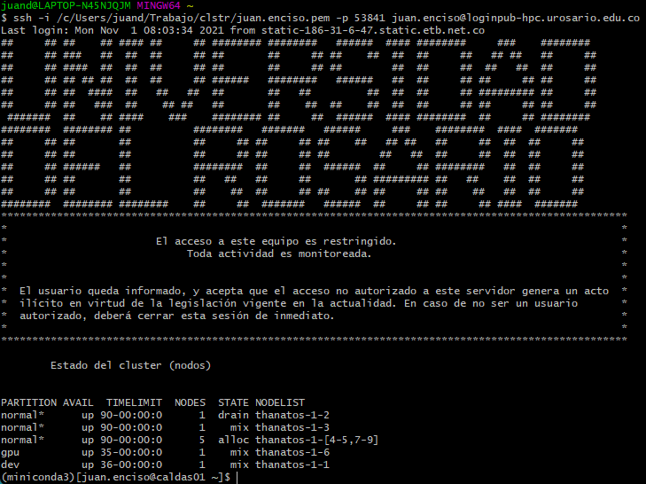

---
---

# Unix básico

## Preparación

**Si estás trabajando en Windows:** Asegúrate de tener instalado [Git
Bash
SDK](https://github.com/git-for-windows/build-extra/releases/tag/git-sdk-1.0.8).
Necesitamos familiarizarnos con el funcionamiento de Copiar y Pegar para
poder navegar fácilmente las diferentes rutas de archivos en nuestra
máquina y en el cluster. Si tienes Git Bash en Windows necesitamos
activar las funciones del teclado que te permiten copiar y pegar texto
en el emulador de terminal.

1.  Abre tu emulador de terminal

2.  Haz click derecho en cualquier parte de la ventana. En el menú
    desplegable haz click en `Options...`

    

3.  En la ventana de opciones ve a la pestaña `Keys`. En la sección
    `Shortcuts` chequea la caja que dice `Ctrl+Shift+letter
            shortcuts`

    

4.  Prueba los nuevos cambios. Asegúrate de que puedes seleccionar y
    copiar texto usando `Ctrl + Shift + c` y pegar texto usando
    `Ctrl + Shift + v`.

**Si estás trabajando en Linux:** Este comportamiento está habilitado
por defecto en Linux. Prueba que puedes copiar usando `Ctrl + Shift + c`
y pegar usando `Ctrl + Shift + v` en tu emulador de terminal. Si no es
posible consulta al personal docente.

**Si estás trabajando en mac OS:** Este comportamiento está habilitado
usando la forma usual de copiar y pegar en mac OS. `⌘ + c` para copiar y
`⌘ + v` para pegar. Prueba que las combinaciones produzcan el
funcionamiento esperado, si no es así consulta al personal docente.

## Navegación del sistema de archivos

Ten un archivo de texto a la mano (NO uses un documento de Word). A
medida que avances en los ejercicios registra los comandos utilizados.
Es buena práctica hacer anotaciones y comentarios de los comandos que
usas, utiliza el caracter `#` para crear comentarios en tus archivos de
texto.

1.  Crea un directorio de trabajo en una ubicación a la que puedas
    acceder fácilmente y asegúrate que puedes acceder a él usando la
    interfaz gráfica y la línea de comandos.

2.  Navega hacia tu directorio de trabajo usando la línea de comandos y
    descarga allí el archivo
    [`linea_comando.zip`](https://github.com/juanenciso14/genomica_biodiversidad/blob/master/material/linea_comando.zip?raw=true)
    usando `wget`.

    Renombra el archivo usando la opción `-O` de `wget` seguida del
    nombre que le quieres dar al archivo. Si no lo renombras tendrá la
    extensión `?raw=true`, la cual no queremos.

3.  Descomprime el archivo que descargaste usando la herramienta
    `unzip`. Qué resulta de hacer esta operación? Qué tipo de objeto es
    `linea_comando`?

4.  Ve a tu carpeta home :house:.

5.  Ve a la carpeta `linea_comando` usando una <u>ruta absoluta</u>.

6.  Ve al directorio `carpeta_4` dentro de `linea_comando` usando una
    <u>ruta relativa</u>.

7.  Usando un solo comando y una <u>ruta relativa</u> ve al directorio
    `ssubcarpeta2.2.2`. ¿Cuál es la ruta absoluta al directorio?

8.  Usando un solo comando y una <u>ruta relativa</u> ve al directorio
    `subCarpeta1.2`

9.  Usando un solo comando y la <u>ruta absoluta</u> ve a
    `subCarpeta3.1`

10. Vuelve a :house: utilizando una ruta relativa.

## Creación de directorios y archivos

-   [ ] Replica la creación de `linea_comando` con todo su contenido.
    Algunos archivos están vacíos y otros contienen texto plano. Replica
    el contenido de estos archivos usando un editor de texto o el
    comando `echo` y el operador de re-dirección. Documenta en tu
    archivo de comandos todos los pasos que seguiste para crear
    `linea_comando`.

    

## Programas disponibles en tu máquina

1.  Comenta qué diferencias observas con las herramientas disponibles en
    los sistemas de tus compañeros de grupo. ¿Todos tienen las mismas
    herramientas disponibles?

2.  Revisa las rutas disponibles en `$PATH`. Escoge una de las rutas que
    observas en `$PATH`, recuerda que están separadas por `:`. ¿Qué
    otras herramientas están disponibles en la ruta que escogiste?
    Nombra por lo menos cuatro de ellas y describe qué hacen. Utiliza
    `man` para explorar la documentación de las herramientas.

## Copia, movimiento y deleción de directorios y archivos

1.  Ve a tu carpeta :house:

2.  Ve a `linea_comando` usando una ruta relativa.

3.  Crea un archivo llamado `lista_carpetas.txt` que contenga la lista
    de carpetas dentro de `linea_comando` ¿Cómo ignoras los archivos y
    te quedas solo con las carpetas? Consulta la ayuda de `ls` usando
    `man`.

4.  Mueve `archivo2.1.2.2.txt` y `Archivo2.1.2.3.txt` a `subcarpeta3.1`
    usando rutas relativas y un solo comando.

5.  Copia `archivo1.2.1.txt` y `archivo1.2.2.txt` a `subcarpeta2.2`. Usa
    un solo comando.

6.  Copia el directorio `ssubcarpeta2.1.2` con todo su contenido a
    `carpeta_4` en un solo comando. ¿Encuentras errores? consulta el
    manual de `cp` para recordar la opción apropiada que debes utilizar.

7.  Borra el directorio `subCarpeta1.2` con todo su contenido en un solo
    comando. Utiliza la opción de verificación de la herramienta usada
    para borrar.

8.  Crea dos archivos vacíos en `carpeta_4` y nómbralos como quieras.

9.  Ve un nivel arriba del directorio `linea_comando`. Comprime la
    carpeta `linea_comando` usando el comando
    `zip -r linea_comando_<nombre>.zip
            linea_comando` donde `<nombre>` es tu nombre. Recuerda no
    dejar espacios en los nombres de archivo.

# Unix no tan básico

## Genes con nombres duplicados

El archivo
[`genes_ch1_mus_musculus.txt`](./material/genes_ch1_mus_musculus.txt)
contiene identificadores de los genes del cromosoma 1 de *Mus musculus*
en la primera columna y los nombres comunes de estos genes en la segunda
columna. Algunos genes tienen nombres repetidos en la derecha. El
objetivo es encontrar las entradas con nombres comunes de genes que
estén duplicados. Las instrucciones utilizadas para resolver este punto
deben guardarse en un script de `bash` que contenga el paso por paso de
la solución.

1.  Usa el comando `cut` para cortar y acceder a columnas individuales
    del archivo de genes del ratón. La opción `-f<n>` te permite escoger
    columnas individuales o grupos de columnas que quieras cortar. Debes
    reemplazar `<n>` por el número de columna que quieras seleccionar.
2.  Usa los comandos `uniq`, `sort` y `grep` para contar la aparición de
    cada nombre en la segunda columna.
3.  Genera una lista con los nombres de los genes repetidos y guárdala
    en un archivo llamado `repetidos_ch1_mmus.txt`
4.  Genera una lista con los nombres de los genes no repetidos y
    guárdala en un archivo llamado `no_repetidos_ch1_mmus.txt`
5.  Responde: ¿Cuántas líneas tiene originalmente el archivo
    `genes_ch1_mus_musculus.txt`?
6.  Responde: Ignorando las repeticiones ¿cuántos genes únicos hay
    realmente en estos datos?
7.  Responde: Reporta el número más alto de repeticiones que tiene un
    gen en este archivo.

## Marcadores de secuencias

Cuando se hacen experimentos de secuenciación a gran escala normalmente
se agregan marcas moleculares para poder identificar las muestras
correctamente al momento de procesar los datos. El archivo
[`tags_seqs.txt.gz`](./material/tags_seqs.txt.gz) contiene dos columnas:
En la columna izquierda hay identificadores moleculares únicos para cada
individuo. Estos tienen el formato `secuencia1-secuencia2`, las dos
secuencias en conjunto se usan para identificar diferentes detalles del
proceso de secuenciación. En la columna 2 del archivo están los
identificadores de cada individuo. <u>No descomprimas el archivo para
trabajar este punto</u>.

1.  Utiliza la herramienta `zless` para verificar la estructura del
    archivo.

2.  Utiliza la versión apropiada de `cat` junto con `cut` y `grep` para
    establecer qué individuos tienen asociadas las siguientes marcas en
    `secuencia2`.

    `TATCCTCT` `GTAAGGAG` `TAGATCGC`

    Recuerda re-dirigir la información entre herramientas usando el
    operador apropiado. Al usar cut puedes especificar el delimitador
    usando la opción `-d` seguida del caracter delimitador entre
    comillas sencillas. Por ejemplo, si el delimitador es un caracter de
    tabulación (`\t`) usarías `-d'\t'`.

    Responde: ¿En total cuántos individuos tienen alguna de estas tres
    secuencias en la segunfa parte de la columna izquierda?

# Trabajando en el cluster de cómputo (CENTAURO)

## Conexión al cluster

Usaremos el programa `ssh` ([secure
shell](https://www.ssh.com/academy/ssh)) para conectarnos a CENTAURO
desde nuestra máquina. El ejemplo que veremos usa [Git Bash
(Windows)](https://gitforwindows.org/). La sintáxis para Linux y mac OS
es la misma.

1.  Descarga y copia la llave de acceso (archivo `.pem`) en una ruta que
    conozcas y a la que puedas acceder fácilmente. En este caso yo creé
    una carpeta llamada `Trabajo` y otra llamada `clstr` dentro de
    `Trabajo` en la ruta `/c/Usuarios/juand/`.

    

2.  Abre una nueva ventana de `Git Bash` o del emulador de terminal con
    el que estés trabajando. Navega tu sistema usando los comandos
    aprendidos para moverte en el sistema de archivos. Ve a la carpeta
    en donde pusiste tu llave de acceso. Haz una lista de los archivos
    en la carpeta, ves la llave `.pem` dentro de esa carpeta?

3.  Utiliza secure shell (`ssh`) para abrir una conexión remota a
    Centauro. Utiliza la opción `-i` para especificar la ruta a la llave
    `.pem` y la opción `-p` para especificar el puerto de acceso
    (53841). A continuación especifica tu nombre de usuario asignado
    seguido de un `@` y finaliza con la dirección pública del cluster
    (`loginpub-hpc.urosario.edu.co`). Observa el ejemplo en la imagen,
    en este caso me estoy conectando desde mi carpeta `home` (`~`).

    

4.  Verifica que la conexión fue exitosa. Deberías observar el siguiente
    texto en pantalla:

    

    Si no logras conectarte con éxito pide ayuda al personal docente.

## Buscando módulos

Podemos encontrar módulos disponibles en el cluster usando dos rutas: La
primera es utilizar el sub-comando `spider` de `module` seguido del
nombre que estamos buscando. La segunda es utilizar el sub-comando
`avail` de `module` y re-dirigir el resultado a `grep` para buscar el
patrón que queremos encontrar.

1.  Utiliza `moldule avail` en conjunto `grep` para buscar algún módulo
    en particular. Prueba buscando los módulos `java`, `stacks` y
    `OrthoMCL`. Describe qué observas en las tres búsquedas.
2.  Utiliza el sub-comando `keyword` de `module` para buscar los tres
    módulos del numeral anterior. Describe qué observas en las tres
    búsquedas.
3.  Utiliza el sub-comando `spider` de `module` para buscar los tres
    módulos del numeral 1. Describe qué observas en las tres búsquedas
4.  ¿Cómo describirías las diferencias entre `keyword` y `spider`?
5.  Consulta la ayuda de `module` usando la opción `-h` y responde:
    ¿Existe alguna forma de consultar los módulos que ya están cargados
    en tu sesión? ¿Cómo lo haces?
6.  Consulta la ayuda de `module` la opción `-h` y responde: ¿Existe
    alguna forma de cargar versiones diferentes de un mismo módulo sin
    realizar dos cargas independientes? ¿Cómo lo haces?

¿Qué diferencias notas?

## La cola de trabajo

El archivo [`bash_loops1.tar.gz`](./material/bash_loops1.tar.gz) fue
creado con la herramienta `tar` y contiene varias carpetas, cada una de
ellas contiene un archivo de texto con un mensaje. Descomprime el
archivo usando `tar` con las opciones `-z`, `-x` y `-f` para poder
explorar la estructura de directorios contenida en el archivo. Explora
el contenido de uno de los archivos de texto para saber cuál es el
mensaje y luego genera una estructura idéntica a la de la carpeta
`bash_loops1`. Utiliza un solo ciclo `for` para generar las carpetas y
crear los archivos con el mensaje. Agrega una pausa de un segundo a cada
iteración del `for` usando la herramienta `sleep`. Pon las instrucciones
correspondientes a los primeros 3 pasos en un script de `bash` con el
código apropiado para poderlo enviar a la cola de trabajos del cluster
usando `sbatch`. A partir del paso 4 trabaja en una sesión interactiva.

1.  Solicita recursos para ejecutar el trabajo. Usa las directivas
    `#SBATCH` en el inicio de tu script para enviar a la cola `normal`,
    solicita un solo procesador, 50MB de memoria RAM y 1h de tiempo de
    ejecución. No olvides incluir el `shebang`!.

2.  Adicionalmente, envía notificaciones a tu correo cuando la tarea
    empiece, termine, o encuentre errores. Usa directivas `#SBATCH` o
    incluye la solicitud de envío de notificaciones al correo y tu
    dirección de correo electrónico como opciones en `sbatch`. Para esto
    usa las opciones `--mail-type` y `--mail-user`.

3.  Haz una predicción de la duración del trabajo en minutos. Para esto
    puedes suponer que cada iteración del ciclo tarda un poco más de un
    segundo debido al comando `sleep`. ¿Cuántas iteraciones tiene la
    tarea?

4.  Al finalizar la ejecución: Verifica la información de corrido que el
    sistema envió a tu correo electrónico, si no puedes encontrar los
    mensajes revisa tu carpeta **Spam**.

5.  Archiva y comprime la estructura resultante usando `tar` y las
    opciones `c`, `z` y `f`. Consulta el manual de `tar` para saber qué
    hace cada opción y cómo organizar el comando.

    ``` shell
    # sintaxis de uso de tar
    tar [OPCIONES] [ARCHIVOS]
    ```

6.  Copia el archivo resultante (`bash_loops1.tar.gz`) a tu máquina
    personal usando `scp` (haz esto desde tu máquina). La sintáxis para
    copiar archivos usando `scp` desde/hacia CENTAURO es:

    ``` shell
    # transfiriendo desde CENTAURO
    scp -i <ruta.llave.pem> -P 53841 \
        usuario@loginpub-hpc.urosario.edu.co:/ruta/al/archivo /rutal/local/

    # transfiriendo hacia CENTAURO
    scp -i <ruta.llave.pem> -P 53841 /rutal/local/archivo \
        usuario@loginpub-hpc.urosario.edu.co:/ruta/para/copiar/
    ```

7.  Envía el archivo resultante (`bash_loops1.tar.gz`) a tu correo
    electrónico usando la herramienta `mailx`. La sintáxis para adjuntar
    archivos y enviarlos a una dirección de correo es la siguiente.

    ``` shell
    mailx -a <adjunto1> -a <adjunto2> \
          -s "Asunto" tu.direccion.de@correo.com

    # Presiona ENTER, luego Ctrl + d, luego ENTER nuevamente
    ```

    <details>
    <summary> Si no logras avanzar escribiendo el script de bash puedes encontrar la respuesta aquí. Asegúrate de hacerlo por tu cuenta primero! </summary>

    ``` shell
    #!/bin/bash
    #SBATCH -p normal
    #SBATCH -n 1
    #SBATCH --mem 500MB
    #SBATCH -t 0-1:00
    #SBATCH --mail-type=BEGIN,END,FAIL
    #SBATCH --mail-user=usuario@urosario.edu.co

    for i in {1..800}
    do
        mkdir carpeta_$i
        cd carpeta_$i
        echo "Hola mundo\nEstamos aprendiendo\nA usar el cluster" > \
             archivo_$i.txt
        cd ..
        sleep 1
    done

    # Para archivar y comprimir bash_loops1 usa
    tar czf bash_loops1.tar.gz bash_loops1

    # ten en cuenta la localizacion de bash_loops1
    ```

    </details>

## Descarga de archivos de secuencia y uso de `screen`

Los dos repositorios más grandes de secuencias de ácidos nucléicos
producidas usando secuenciación de nueva generación son el European
Nucleotide Archive [ENA (EBI)](https://www.ebi.ac.uk/) y el Sequence
Read Archive [SRA (NCBI)](https://www.ncbi.nlm.nih.gov/sra).
Aprenderemos a descargar datos de secuenciación desde ENA usando `wget`.
La descarga desde SRA es un poco más compleja y está fuera del alcance
de este curso.

El archivo
[`lista_muestras_descarga.txt`](./material/lista_muestras_descarga.txt)
contiene cuatro columnas con la siguiente información: i. Especie
abreviada ii. Subespecie abreviada iii. Identificador de muestra y iv.
Identificador de secuencia. **En tu máquina local haz lo siguiente**.

1.  Escoge uno de los individuos y copia su identificador de secuencia.

2.  Ve al [sitio web de EBI](https://www.ebi.ac.uk/) y pega el
    identificador en el buscador, como lo muestra la imagen.

    

    Presiona el botón de búsqueda.

3.  En la lista de resultados haz click en el identificador
    correspondiente al primer resultado

    

4.  En la siguiente página encuentras una sección con la información de
    la muestra, la plataforma en la que fue secuenciada y las
    características de la librería usada. En particular fíjate en los
    items **Library Layout**, **Library Strategy** y **Library Source**
    ¿Te dicen algo sobre los datos que vas a descargar?

    Ve al fondo de la página a la sección `Read Files`. En la tabla
    verás 7 columnas, la última (Generated FASTQ files: FTP) contiene
    los enlaces que usaremos para la descarga ¿Por qué hay dos enlaces
    si solo tenemos una muestra?

    

5.  Vamos a descargar la información de **ambos** enlaces; necesitamos
    ambas piezas de información. Haz click derecho en cada uno de los
    enlaces, cópialos (copiar enlace) y pégalos en tu archivo de
    comandos.

6.  **Ve ahora al cluster, a tu carpeta de trabajo.** Crea un directorio
    llamado `descarga_muestras` y entra en él.

7.  Para esta tarea no enviaremos los trabajos a la cola porque <u>los
    nodos de trabajo no están conectados a internet</u> y no pueden
    realizar descargas. Usaremos un programa llamado `screen` en el nodo
    maestro. `screen` nos permite dejar una tarea ejecutándose y nos da
    la posibilidad de desacoplar nuestra sesión para que el trabajo se
    siga ejecutando aún cuando nos desconectemos del cluster. Escribe
    `screen -S <sesion>` en donde `<sesion>` debe ser reemplazado por el
    nombre que quieras darle a la sesión de descarga. Por ejemplo,
    puedes llamarla `descarga_NGS`. Verás que se abre una nueva sesión
    de trabajo.

8.  En esta sesión nueva usarás `wget` para descargar uno de los dos
    archivos de secuencias de NGS que encontramos en ENA. La sintáxis
    recomendada para descargar este archivo con `wget` es la siguiente:

    `wget -O <nombre.de.archivo> <ruta/de/enlace>`

    En donde `<nombre.de.archivo>` es el nombre con el que quieres
    guardar el archivo en el cluster y `<ruta/de/enlace>` es una de las
    dos rutas que copiaste en tu editor de texto.

    Dale un nombre informativo a tu archivo. Puedes usar la información
    que encuentras en
    [`lista_muestras_descarga.txt`](./material/lista_muestras_descarga.txt)
    de la siguiente forma: `especie.subespecie.R1.fastq.gz` o
    `especie.subespecie.R2.fastq.gz` dependiendo de si bajas el primer
    (<sub>1</sub>) o el segundo (<sub>2</sub>) conjunto de secuencias.

9.  Ejecuta la línea que acabas de escribir. Asegúrate de que estás
    haciendo la descarga, puedes verificar que la descarga se está
    haciendo si no observas errores y `wget` imprime en pantalla algo
    como esto:

    

10. Como puedes ver estos archivos toman bastante tiempo para descargar,
    es por eso que usamos `screen`; si nos desconectáramos así nada más
    perderíamos la descarga y nos tocaría iniciar nuevamente. Presiona
    `Ctrl + a` y luego `d` para desacoplar la sesión y dejar a `wget`
    trabajando después de que te desconectes. Verifica con un instructor
    que tu procedimiento de descarga funciona y que puedes desacoplar tu
    sesión de `screen`.

11. **Re-acoplando la sesión desacoplada**. `screen` te permite
    conectarte nuevamente a la sesión en la que estabas trabajando antes
    mediante la opción `-r`. Si solo tienes una sesión de `screen`
    desacoplada puedes ejecutar solamente `screen -r`, si tienes más de
    una sesión desacoplada debes ejecutar `screen -r <sesion>` donde
    `<sesion>` es el nombre que le diste a tu sesión de `screen` en el
    paso 7. Verifica que puedes conectarte nuevamente a la sesión de
    descarga y desacopla la sesión nuevamente con `Ctrl + a` y `d`.
