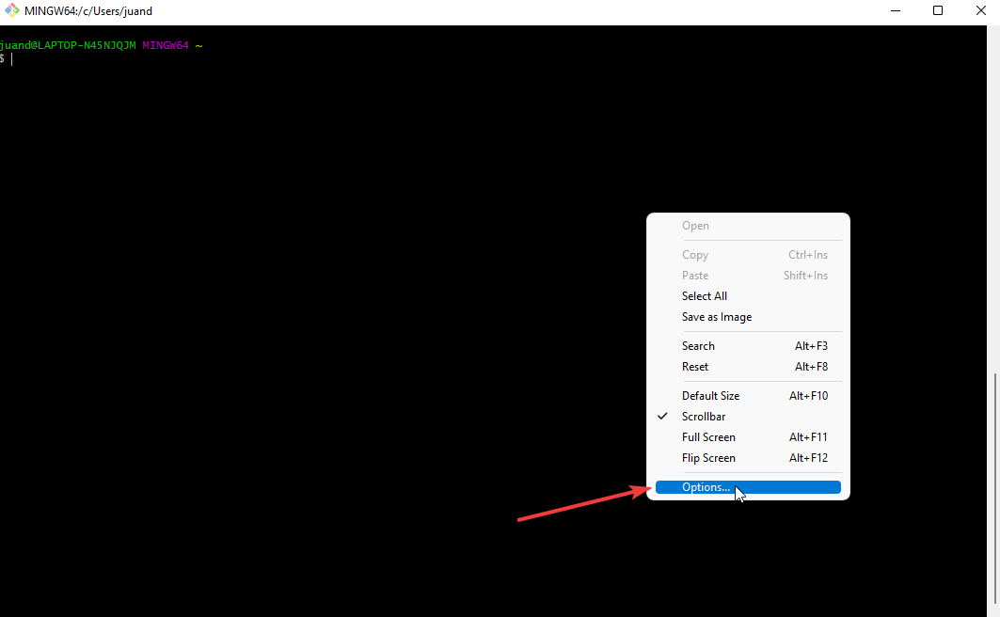

---
---

# TODO Unix básico

## TODO Preparación

**Si estás trabajando en Windows:** Asegúrate de tener instalado [Git
Bash](https://gitforwindows.org/). Necesitamos familiarizarnos con el
funcionamiento de Copiar y Pegar para poder navegar fácilmente las
diferentes rutas de archivos en nuestra máquina y en el cluster. Si
tienes Git Bash en Windows necesitamos activar las funciones del teclado
que te permiten copiar y pegar texto en el emulador de terminal.

1.  Abre tu emulador de terminal

2.  Haz click derecho en cualquier parte de la ventana. En el menú
    desplegable haz click en `Options...`.

    

3.  En la ventana de opciones ve a la pestaña `Keys`. En la sección
    `Shortcuts` chequea la caja que dice `Ctrl+Shift+letter
            shortcuts`

    

4.  Prueba los nuevos cambios. Asegúrate de que puedes seleccionar y
    copiar texto usando `Ctrl + Shift + c` y pegar texto usando
    `Ctrl + Shift + v`.

**Si estás trabajando en Linux:** Este comportamiento está habilitado
por defecto en Linux. Prueba que puedes copiar usando `Ctrl + Shift + c`
y pegar usando `Ctrl + Shift + v` en tu emulador de terminal. Si no es
posible consulta al personal docente.

**Si estás trabajando en Mac:** Este comportamiento está habilitado
usando la forma usual de copiar y pegar en Mac. `⌘ + c` para copiar y
`⌘ + v` para pegar. Prueba que las combinaciones produzcan el
funcionamiento esperado, si no es así consulta al personal docente.

## TODO 

## TODO 

# TODO Unix no tan básico

## TODO 

## TODO 

# TODO Trabajando en el cluster de cómputo (CENTAURO)

## TODO Conexión al cluster

Usaremos el programa `ssh` ([secure
shell](https://www.ssh.com/academy/ssh)) para conectarnos a CENTAURO
desde nuestra máquina. El ejemplo que veremos usa [Git Bash
(Windows)](https://gitforwindows.org/). La sintáxis para Linux y Mac (OS
X) es la misma.

1.  Descarga y copia la llave de acceso (archivo `.pem`) en una ruta que
    conozcas y a la que puedas acceder fácilmente. En este caso yo creé
    una carpeta llamada `Trabajo` y otra llamada `clstr` dentro de
    `Trabajo` en la ruta `/c/Usuarios/juand/`.

    

2.  Abre una nueva ventana de `Git Bash` o del emulador de terminal con
    el que estés trabajando. Navega tu sistema usando los comandos
    aprendidos para moverte en el sistema de archivos. Ve a la carpeta
    en donde pusiste tu llave de acceso.

3.  

4.  

## TODO Ambiente de trabajo

## TODO Módulos

## TODO La cola de trabajo
